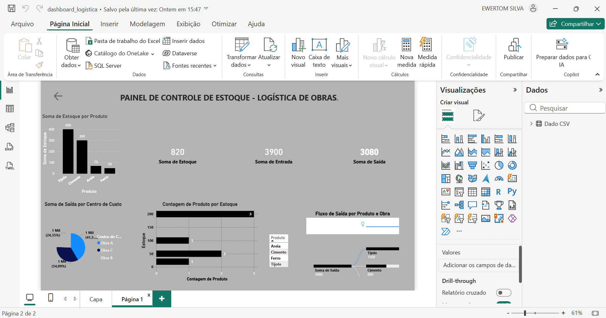

# 📊 Análise de Dados + Dashboard Power BI

## 🚀 Sobre o Projeto
Este projeto realiza análise de dados utilizando Python e apresenta os resultados em um dashboard interativo no Power BI.

---

## 🛠 Tecnologias Utilizadas
- Python
- Pandas
- Power BI

---

## 📈 Etapas do Projeto
✔️ Leitura dos dados  
✔️ Tratamento e limpeza  
✔️ Análise exploratória  
✔️ Geração de insights  
✔️ Criação do dashboard  

---

## 📊 Dashboard
(EM BREVE IMAGEM DO DASHBOARD)

---

## 📂 Arquivos
- Analise.py  
- dashboard_logistica.pbix  

---

## 👨‍💻 Autor
Ewertom de Souza Silva  
